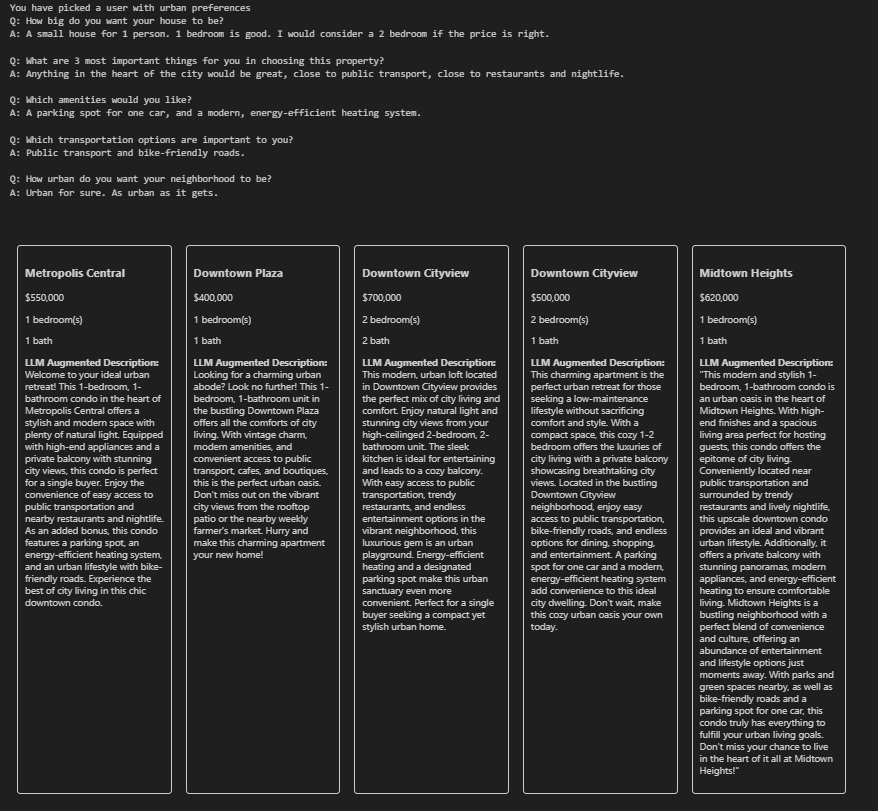

# HomeMatch

This application leverages large language models (LLMs) and vector databases to transform standard real estate listings into personalized narratives that resonate with potential buyers' unique preferences and needs, without compromising the integrity of the original listings.



## Features

The application includes predefined responses to queries that assess the preferences of prospective home buyers.

We've included two sets of responses: one tailored for urban-oriented buyers and the other for those leaning towards suburban preferences.

## Important files

| File                    | Note                                                             |
| ----------------------- | ---------------------------------------------------------------- |
| Listings.txt            | A file containing sample listings in JSON format                 |
| HomeMatch.ipynb         | Jupyter notebook                                                 |
| my_opanai_api_helper.py | A python file containing helper methods to access the OpenAI API |

## Dependencies

All required libraries are listed in "requirements.txt".

They can be installed using the following pip command.

```
pip install -r requirements.txt
```

## How to run

In "my_opanai_api_helper.py" replace "YOUR_API_KEY_HERE" with your OpenAI API key.

Run the Jupyter notebook "HomeMatch.ipynb"

The application will prompt you to pick an urban or suburban user
